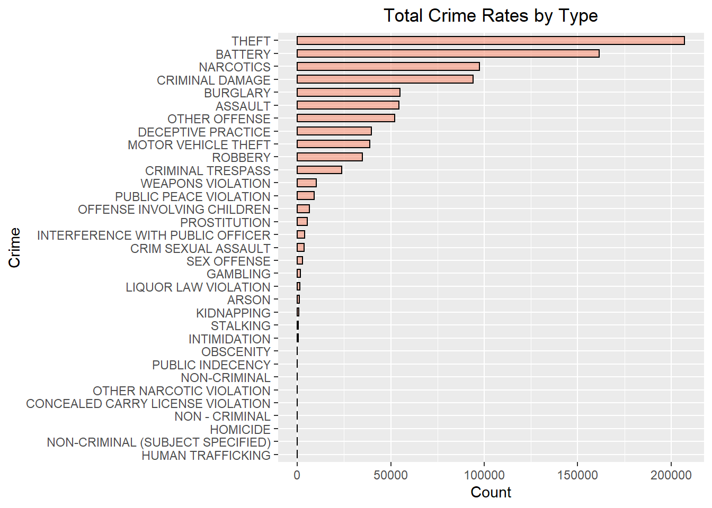
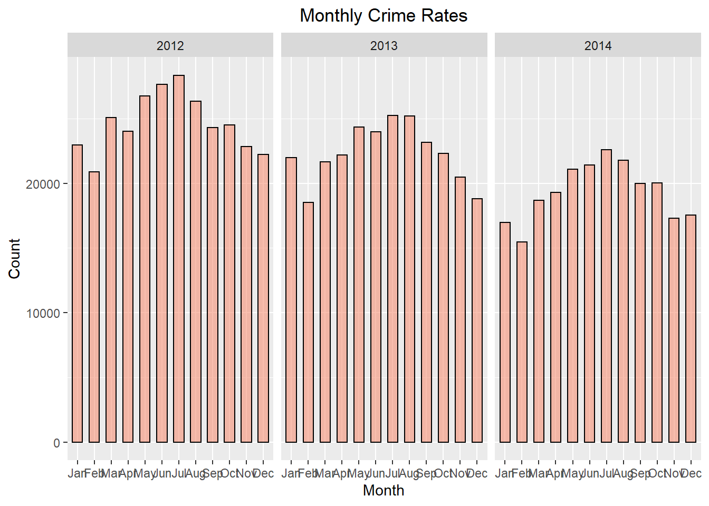
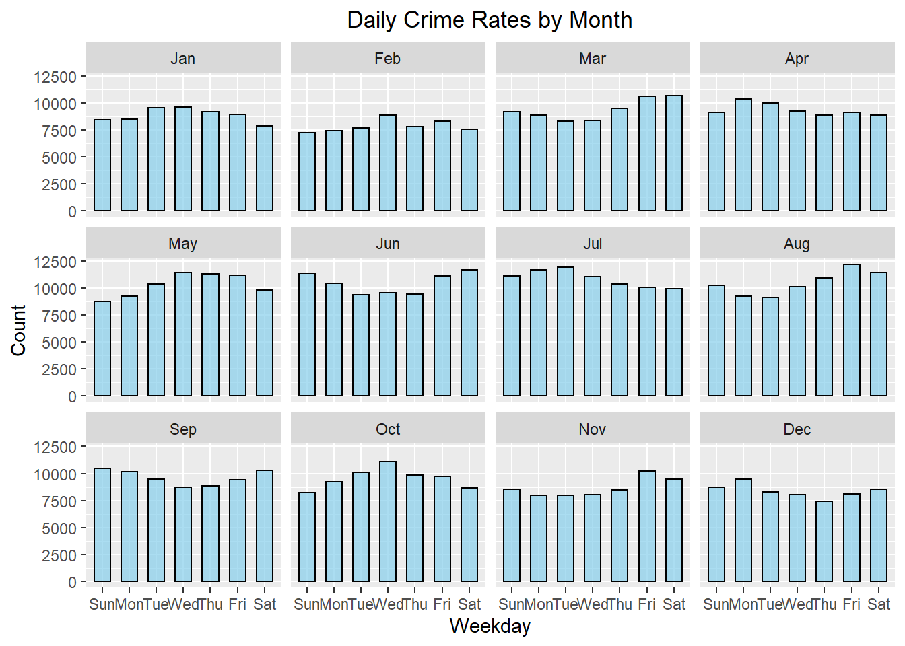
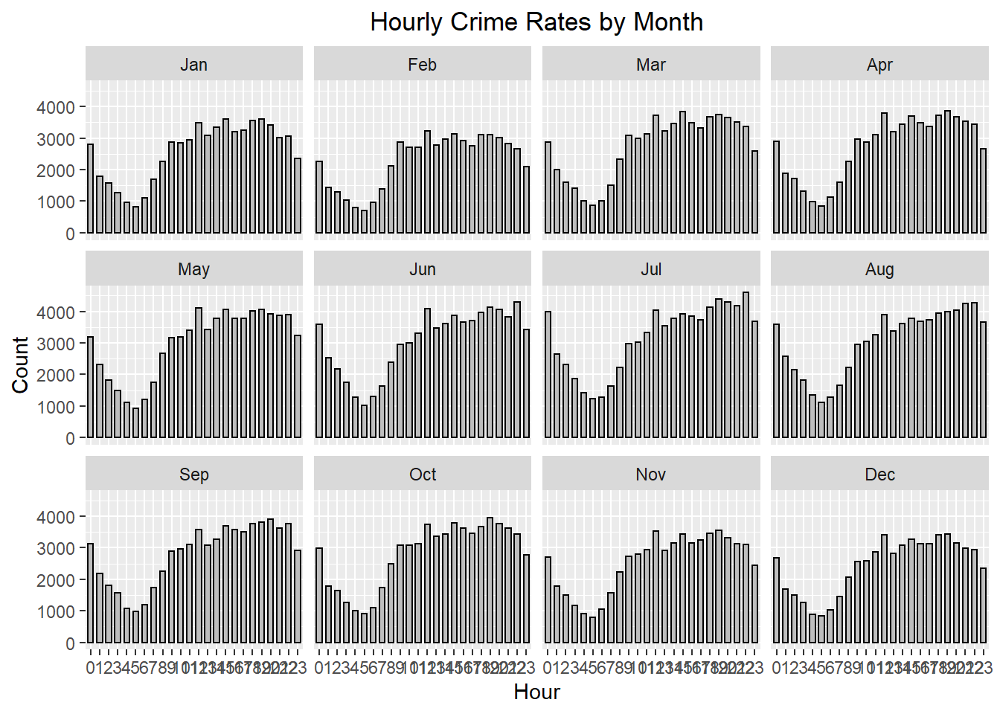
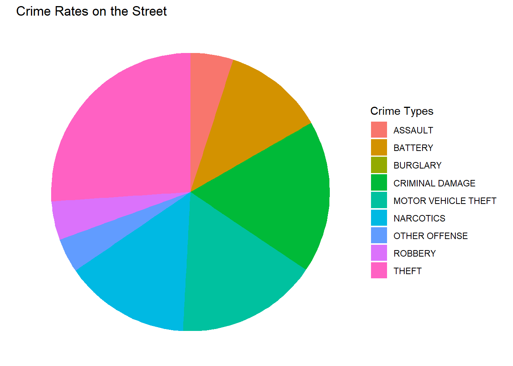
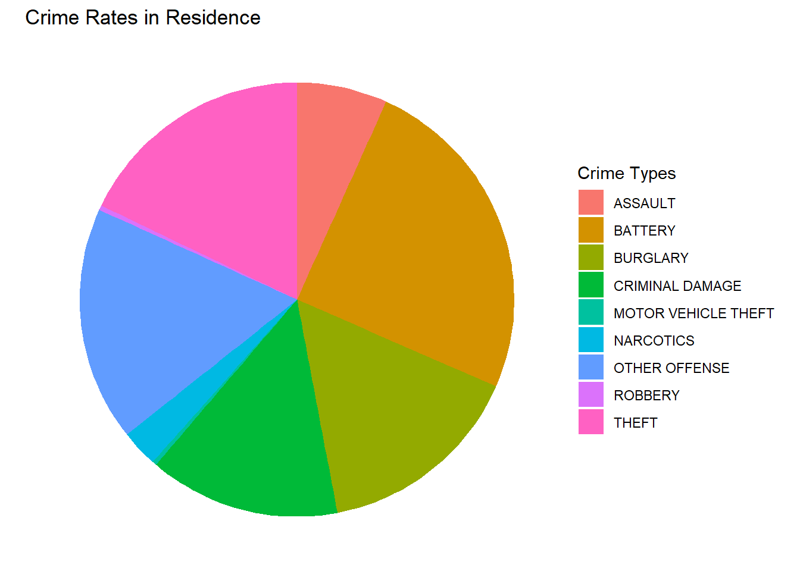
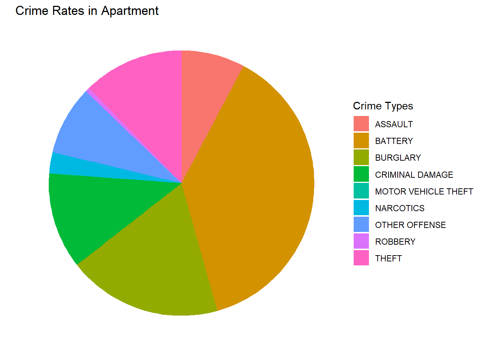
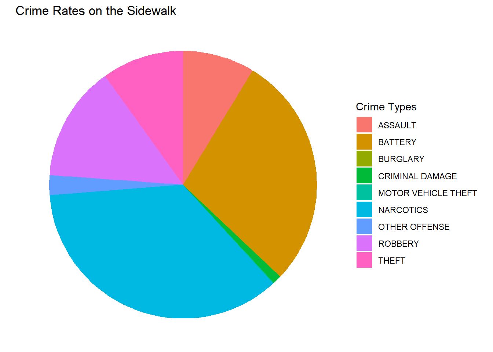
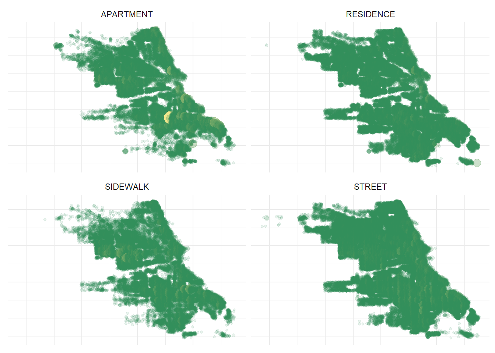
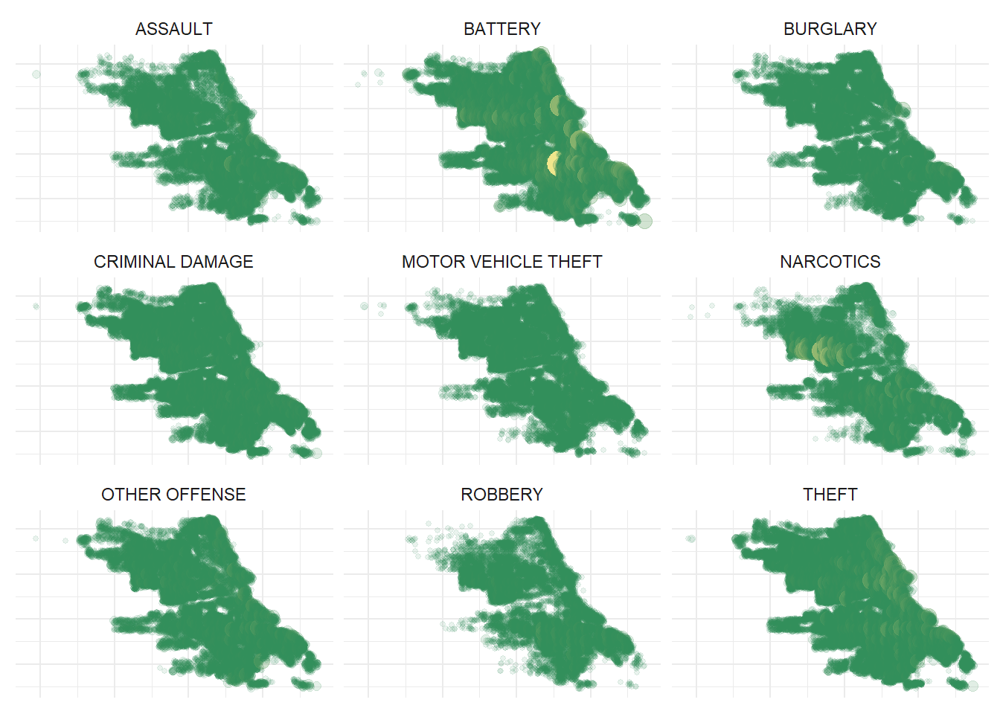

Chicago Crimes Statistics
================

### Packages

``` r
library(ggplot2)
library(tidyverse)
library(ggmap)
library(lubridate)
library(maps)
library(forcats)
```

### Import Data

``` r
df <- read.csv("C:/Users/Long Nguyen/Box/My folder/Project/Crime/Chicago/Chicago_Crimes_2012_to_2017.csv")
```

``` r
# Omit missing values
df <- na.omit(df)
names(df)<- tolower(names(df))
df <- filter(df, year < 2015,x_coordinate != 0, y_coordinate != 0)

# Reformat Date values
df$date <- mdy_hm(df$date)
df$Day <- factor(day(as.POSIXlt(df$date, format="%m/%d/%Y %H:%M:%S")))
df$Month <- factor(month(as.POSIXlt(df$date, format="%m/%d/%Y %H:%M:%S"), label = TRUE))
df$Weekday <- factor(wday(as.POSIXlt(df$date, format="%m/%d/%Y %H:%M:%S"), label = TRUE))
df$Hour <- factor(hour(as.POSIXlt(df$date, format="%m/%d/%Y %H:%M:%S")))
```

### Exploring the Dataset

``` r
# Sorting Crimes 
by_type <- df %>% group_by(primary_type) %>% summarise(Total = n()) %>% arrange(desc(Total))
```

    ## `summarise()` ungrouping output (override with `.groups` argument)

``` r
by_type$primary_type <- factor(by_type$primary_type,levels = by_type$primary_type[order(by_type$Total)])

# Plot
by_type %>%
  mutate(name = fct_reorder(primary_type,Total)) %>%
  ggplot(aes(x=primary_type, y = Total)) +
    geom_bar(stat="identity", colour="black", fill="#f68060", alpha=.5, width=.6) +
    coord_flip() +
    xlab('Crime')+
    ylab('Count')+
    ggtitle("Total Crime Rates by Type")+
    theme(plot.title = element_text(hjust = 0.5))
```



``` r
# Get the top 9 most common crimes 
common_crimes <- filter(df, primary_type %in% c('THEFT','BATTERY','ASSAULT','CRIMINAL DAMAGE','ROBBERY',
                                    'OTHER OFFENSE','NARCOTICS','BURGLARY','MOTOR VEHICLE THEFT'))
```

``` r
#Plotting Crime Rates
ggplot(data=common_crimes, aes(x=Month)) +
  geom_bar(colour="black", fill="#f68060", alpha=.5, width=.6) +
  facet_wrap(~ year, nrow = 1) +
  ylab('Count')+
  ggtitle("Monthly Crime Rates")+
  theme(plot.title = element_text(hjust = 0.5))
```



``` r
ggplot(data=common_crimes, aes(x=Weekday)) +
  geom_bar(colour="black", fill="skyblue", alpha=.7, width=.6)+
  facet_wrap(~ Month, nrow = 3) +
  ylab('Count')+
  ggtitle("Daily Crime Rates by Month")+
  theme(plot.title = element_text(hjust = 0.5))
```



``` r
ggplot(data=common_crimes, aes(x=Hour)) +
  geom_bar(colour="black", fill="gray", width=.6) +
  facet_wrap(~ Month, nrow = 3) +
  ylab('Count')+
  ggtitle("Hourly Crime Rates by Month")+
  theme(plot.title = element_text(hjust = 0.5))
```



``` r
#Common location
by_location <- common_crimes %>% group_by(location_description) %>% summarise(Total = n()) %>% arrange(desc(Total))                                   
```

    ## `summarise()` ungrouping output (override with `.groups` argument)

``` r
head(by_location)
```

    ## # A tibble: 6 x 2
    ##   location_description            Total
    ##   <fct>                           <int>
    ## 1 STREET                         188127
    ## 2 RESIDENCE                      122169
    ## 3 APARTMENT                      103478
    ## 4 SIDEWALK                        98260
    ## 5 OTHER                           26979
    ## 6 PARKING LOT/GARAGE(NON.RESID.)  23344

``` r
common_location <- filter(common_crimes, location_description %in% c('STREET','RESIDENCE','APARTMENT','SIDEWALK'))
```

``` r
# Plot

street <- filter(common_location,location_description %in% c('STREET'))
streetm <- street %>% group_by(primary_type) %>% summarise(Total = n()) %>% arrange(desc(Total))
```

    ## `summarise()` ungrouping output (override with `.groups` argument)

``` r
ggplot(streetm, aes(x="", y=Total, fill=primary_type))+
  geom_bar(stat = "identity", width = 1)+
  coord_polar("y", start=0, direction = -1) +
  theme(plot.title = element_text(vjust = 0.5))+
  ggtitle("Crime Rates on the Street")+
  labs(fill = "Crime Types")+
  theme_void()
```



``` r
residence <- filter(common_location,location_description %in% c('RESIDENCE'))
residencem <- residence %>% group_by(primary_type) %>% summarise(Total = n()) %>% arrange(desc(Total))
```

    ## `summarise()` ungrouping output (override with `.groups` argument)

``` r
ggplot(residencem, aes(x="", y=Total, fill=primary_type))+
  geom_bar(stat = "identity", width = 1)+
  coord_polar("y", start=0, direction = -1) +
  theme(plot.title = element_text(vjust = 0.5))+
  ggtitle("Crime Rates in Residence")+
  labs(fill = "Crime Types")+
  theme_void()
```



``` r
apartment <- filter(common_location,location_description %in% c('APARTMENT'))
apartmentm <- apartment %>% group_by(primary_type) %>% summarise(Total = n()) %>% arrange(desc(Total))
```

    ## `summarise()` ungrouping output (override with `.groups` argument)

``` r
ggplot(apartmentm, aes(x="", y=Total, fill=primary_type))+
  geom_bar(stat = "identity", width = 1)+
  coord_polar("y", start=0, direction = -1) +
  theme(plot.title = element_text(vjust = 0.5))+
  ggtitle("Crime Rates in Apartment")+
  labs(fill = "Crime Types")+
  theme_void()
```



``` r
sidewalk <- filter(common_location,location_description %in% c('SIDEWALK'))
sidewalkm <- sidewalk %>% group_by(primary_type) %>% summarise(Total = n()) %>% arrange(desc(Total))
```

    ## `summarise()` ungrouping output (override with `.groups` argument)

``` r
ggplot(sidewalkm, aes(x="", y=Total, fill=primary_type))+
  geom_bar(stat = "identity", width = 1)+
  coord_polar("y", start=0, direction = -1) +
  theme(plot.title = element_text(vjust = 0.5))+
  ggtitle("Crime Rates on the Sidewalk")+
  labs(fill = "Crime Types")+
  theme_void()
```



``` r
# Mapping Crime by Location
common_location %>% 
  group_by(location_description, longitude, latitude) %>% 
  count() %>% 
  ungroup() %>% 
  ggplot(aes(longitude, latitude, size = n, color = n, alpha = n))+
  geom_point(show.legend = FALSE)+
  facet_wrap(~location_description) +
  scale_color_gradient(low = "seagreen", high = "khaki")+
  theme_minimal()+
  theme(axis.title = element_blank(),axis.text = element_blank())
```



``` r
# Mapping Crime by Crime Types 
common_location %>% 
  group_by(primary_type, longitude, latitude) %>% 
  count() %>% 
  ungroup() %>% 
  ggplot(aes(longitude, latitude, size = n, color = n, alpha = n))+
  geom_point(show.legend = FALSE)+
  facet_wrap(~primary_type) +
  scale_color_gradient(low = "seagreen", high = "khaki")+
  theme_minimal()+
  theme(axis.title = element_blank(),axis.text = element_blank())
```


